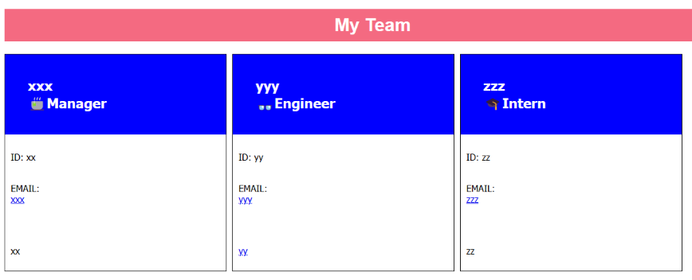

# **TEAM PROFILE Generator**  

  
  

---

  
      
 

### *Motivation*  

    AS A manager
    I WANT to generate a webpage that displays my team's basic info
    SO THAT I have quick access to their emails and GitHub profiles
      
  
  

### *Description*  

    I am prompted for my team members and their information
    an HTML file is generated that displays a nicely formatted team roster based on user input  
    I click on an email address in the HTML
    my default email program opens and populates the TO field of the email with the address
    I click on the GitHub username
    that GitHub profile opens in a new tab

### *Requirements*  
  

    Will need Inquirer version 8.2.4 installation. Use the following command in your project folder: npm i inquirer@8.2.4.  
  
  

### *Instructions*  
  

    WHEN I start the application
    THEN I am prompted to enter the team manager’s name, employee ID, email address, and office number
    WHEN I enter the team manager’s name, employee ID, email address, and office number
    THEN I am presented with a menu with the option to add an engineer or an intern or to finish building my team
    WHEN I select the engineer option
    THEN I am prompted to enter the engineer’s name, ID, email, and GitHub username, and I am taken back to the menu
    THEN I select the intern option
    THEN I am prompted to enter the intern’s name, ID, email, and school, and I am taken back to the menu
    WHEN I decide to finish building my team
    THEN I exit the application, and the HTML is generated 
  
  

### *Test Instructions*  
  

    From command line run: NPM run test  
  
  

### *GitHub Repository* 

[Link here](https://github.com/JosieSavill/TeamProfileGenerator)
   
      
### *DEMO video*  
 [Link here](https://drive.google.com/file/d/1EUGsgedWDQfh-PSK7ICPC095EXkSRSvu/view)